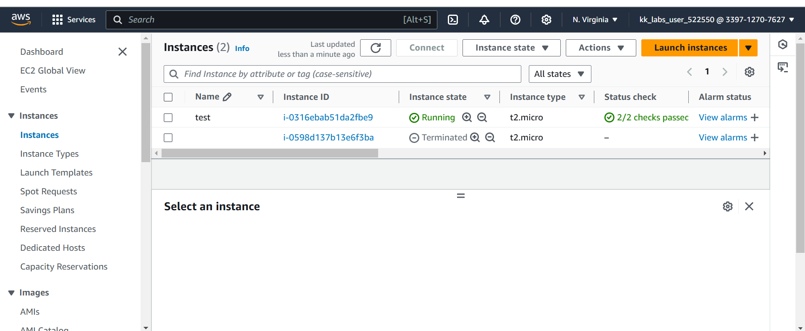
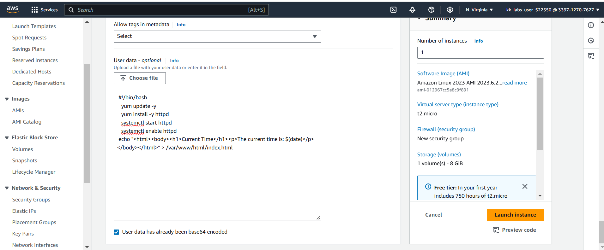

 Project Overview: Real-Time Web Application with User Data

In this project, we will launch an EC2 instance that automatically installs and configures a simple web application
using a User Data script. This application will serve a webpage that displays real-time data, such as the current time.

Step-by-Step Guide

Step 1: Create an EC2 Instance with User Data

1. **Log in to the AWS Management Console** and navigate to the **EC2** dashboard.

2. **Launch an Instance:**
   - Click on "Launch Instance."
   - Choose an Amazon Machine Image (AMI), such as **Amazon Linux 2**.
   - Select an instance type (e.g., `t2.micro` for the free tier).
   - In the "Configure Instance" step, look for the **User Data** section.
 Project Overview: Real-Time Web Application with User Data

In this project, we will launch an EC2 instance that automatically installs and configures a simple web application
using a User Data script. This application will serve a webpage that displays real-time data, such as the current time.

Step-by-Step Guide

Step 1: Create an EC2 Instance with User Data

1. **Log in to the AWS Management Console** and navigate to the **EC2** dashboard.

2. **Launch an Instance:**
   - Click on "Launch Instance."

   


   - Choose an Amazon Machine Image (AMI), such as **Amazon Linux 2**.
   
   - Select an instance type (e.g., `t2.micro` for the free tier).
   

   - In the "Configure Instance" step, look for the **User Data** section.


3. **Add User Data Script:**
   In the User Data field, enter the following script:

   ```bash
   #!/bin/bash
   yum update -y
   yum install -y httpd
   systemctl start httpd
   systemctl enable httpd

   # Create a simple HTML page that displays the current time
   echo "<html><body><h1>Current Time</h1><p>The current time is: $(date)</p></body></html>" > /var/www/html/index.html
   ```
   


4. **Configure Security Group:**
   - Allow inbound traffic on port `80` (HTTP) and `22` (SSH).
    

5. **Review and Launch:**
   - Review your configurations and click "Launch."
   - Choose or create a key pair for SSH access.

Step 2: Access Your Application

1. **Get the Public IP Address:**
   - Once the instance is running, note the public IP address from the EC2 dashboard.

2. **Open a Web Browser:**
   - Navigate to `http://your-instance-public-ip`.
   - You should see a webpage displaying the current time.

Step 3: Verify the User Data Execution
 

