Install and Setup AWS cli on Local machine
Config PA credentials 

- Create VPC using cli

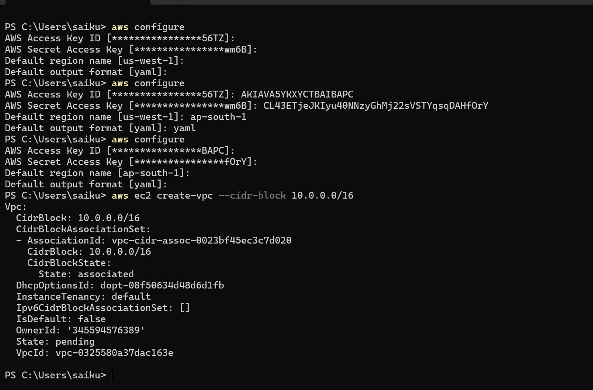

- create Pub and Pvt subnets

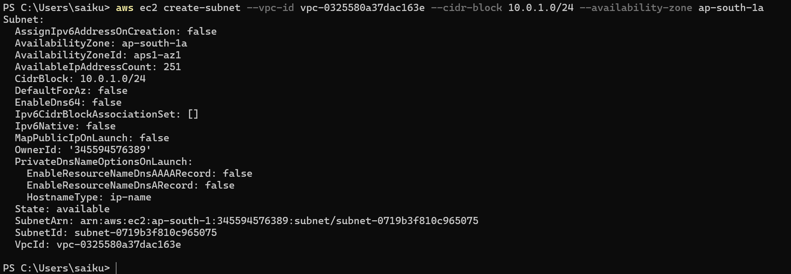

- create IGW

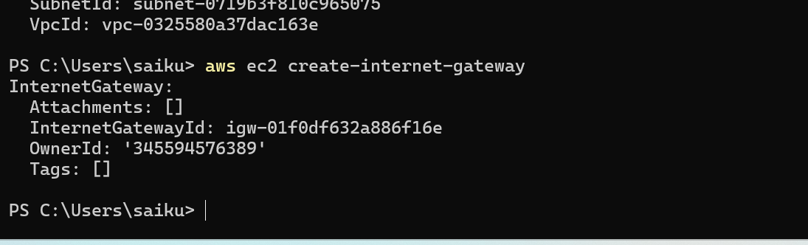

- Attach IGW to VPC
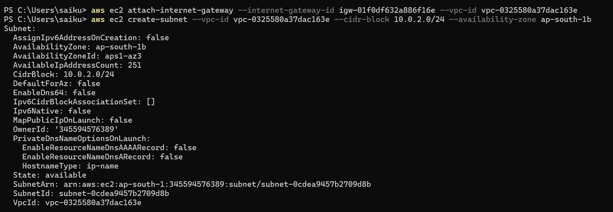
- Create Pub and PVT RT
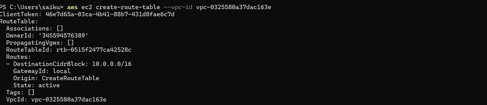
- Attach Pub sub to Pub rt
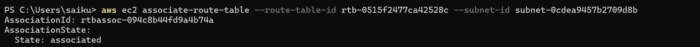
- Attach Pvt Sub to Pvt rt
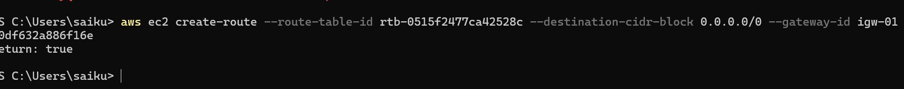
- Attach IGW to Pub RT

- Create Sg for ssh // http
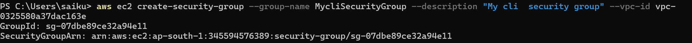
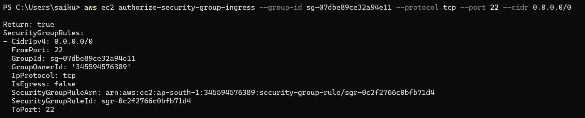
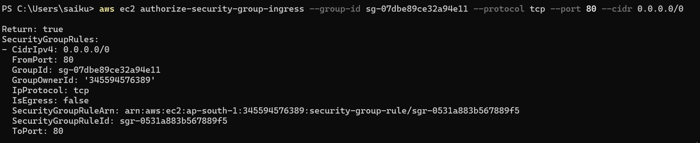

- Create a Ec2 in Pub Sub

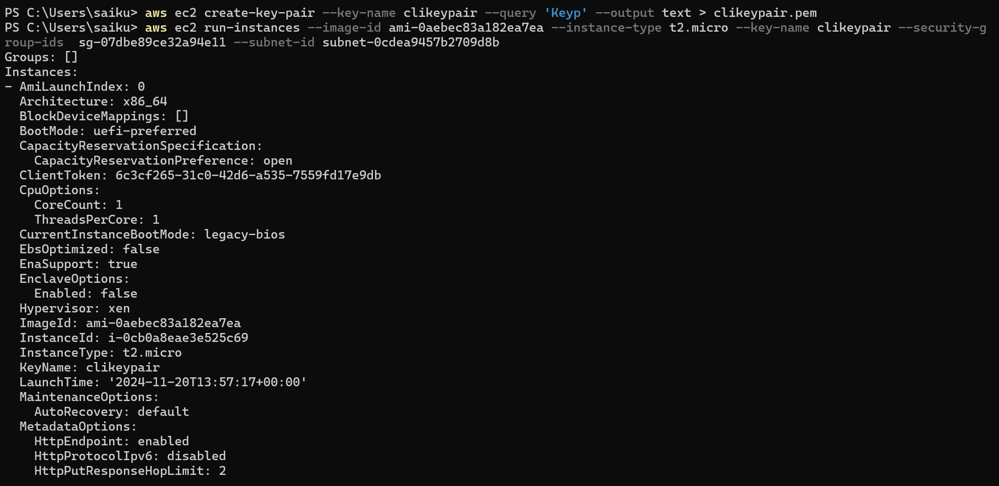
