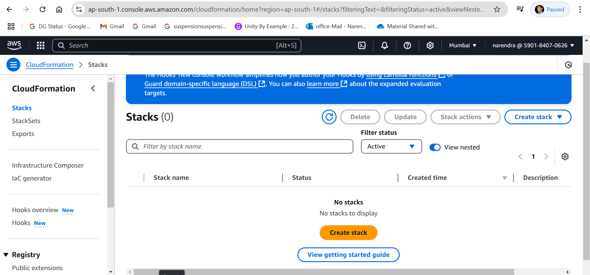
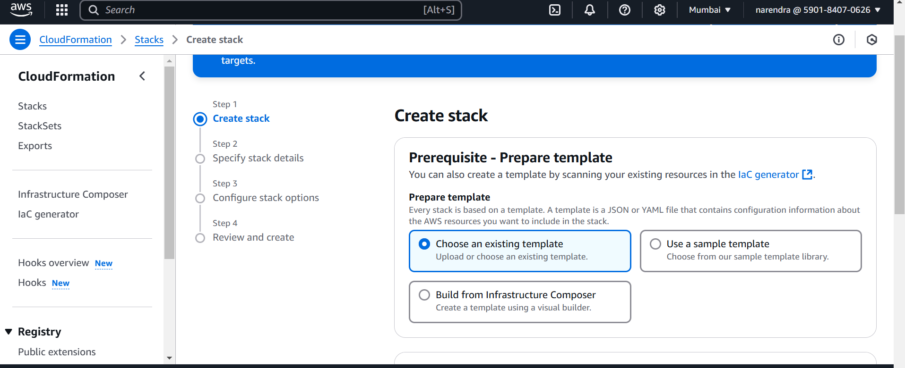
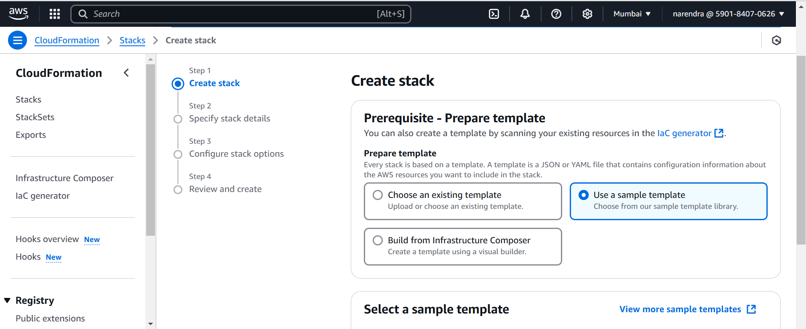
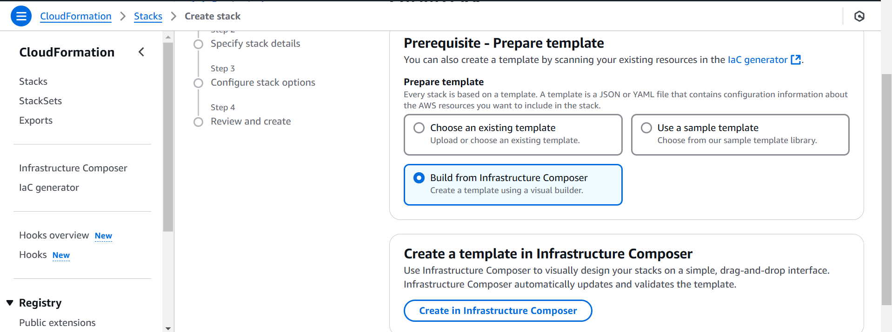
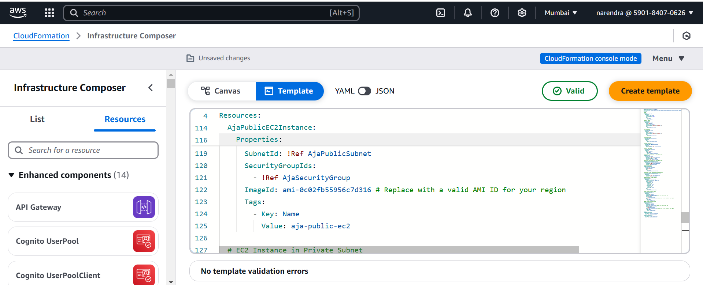
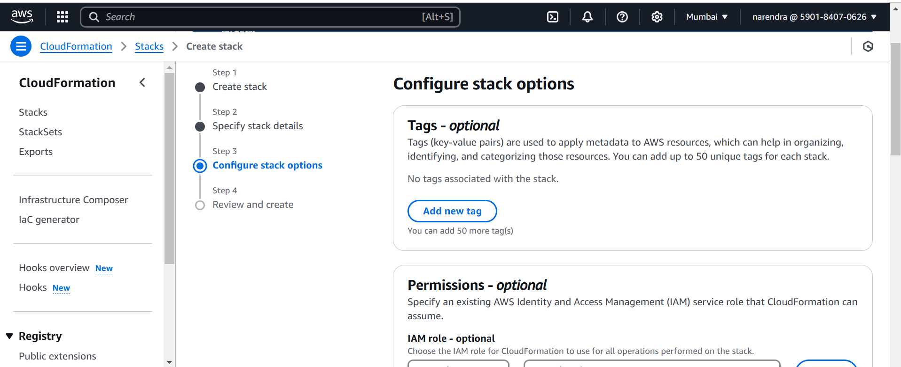
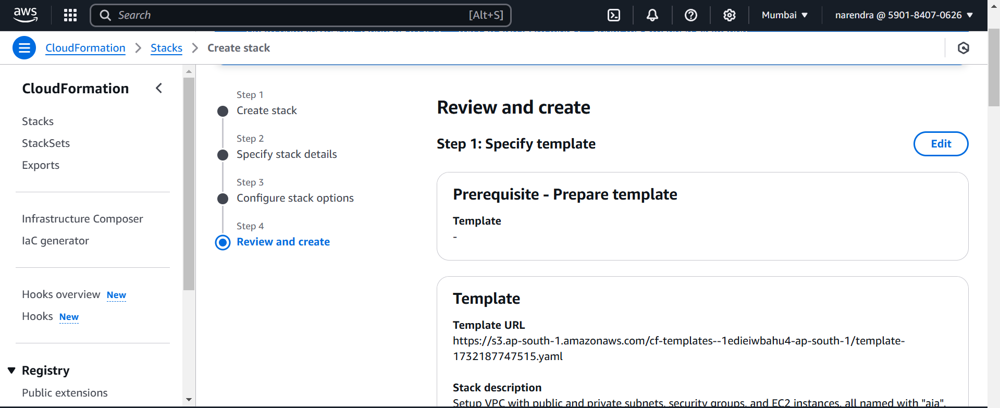
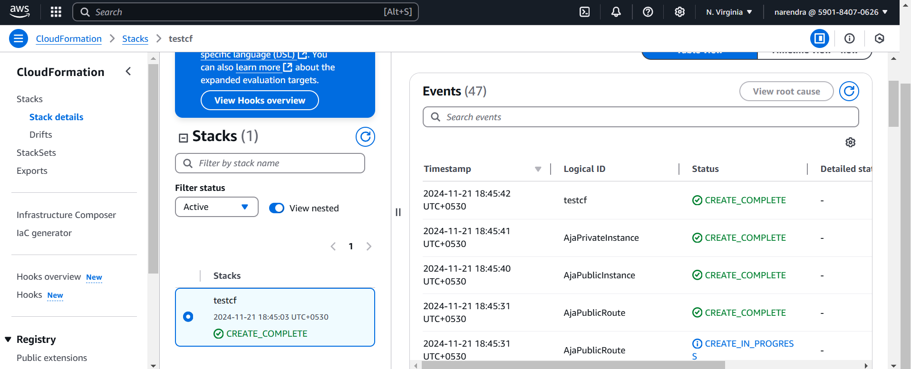
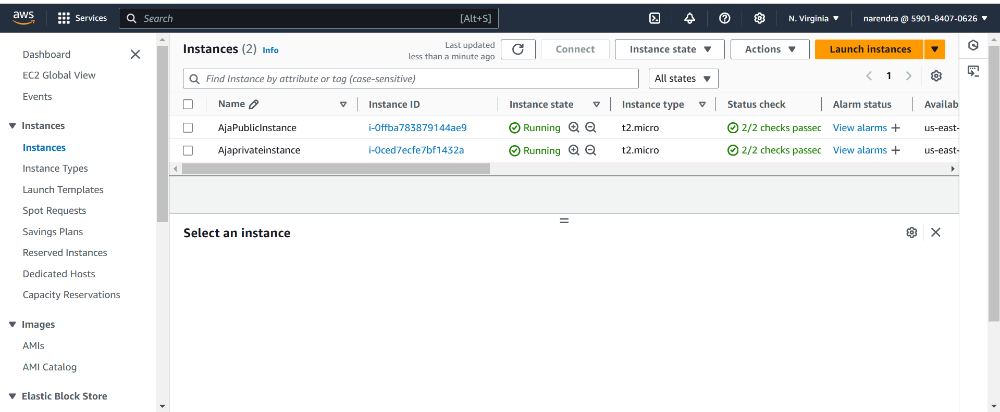

## Create VPC using cloud formation
Resources:
  # VPC
  AjaVPC:
    Type: AWS::EC2::VPC
    Properties:
      CidrBlock: 10.0.0.0/16
      EnableDnsSupport: 'true'
      EnableDnsHostnames: 'true'
      Tags:
        - Key: Name
          Value: aja-vpc
 ## create Pub and Pvt subnets         
   # Public Subnet
  AjaPublicSubnet:
    Type: AWS::EC2::Subnet
    Properties:
      VpcId: !Ref AjaVPC
      CidrBlock: 10.0.1.0/24  
      AvailabilityZone: "us-east-1b"
      Tags:
        - Key: Name
          Value: aja-public-subnet
# Private Subnet
  AjaPrivateSubnet:
    Type: AWS::EC2::Subnet
    Properties:
      VpcId: !Ref AjaVPC
      CidrBlock: 10.0.8.0/24
      AvailabilityZone: "us-east-1a"
      Tags:
        - Key: Name
          Value: aja-private-subnet
## Attach IGW to VPC
  # Internet Gateway
  AjaInternetGateway:
    Type: AWS::EC2::InternetGateway
    Properties:
      Tags:
        - Key: Name
          Value: aja-internet-gateway
  # Attach IGW to VPC
  AjaAttachGateway:
    Type: AWS::EC2::VPCGatewayAttachment
    Properties:
      VpcId: !Ref AjaVPC
      InternetGatewayId: !Ref AjaInternetGateway
 ## Create Pub and PVT RT      
  # Public Route Table
  AjaPublicRouteTable:
    Type: AWS::EC2::RouteTable
    Properties:
      VpcId:  
        Ref: AjaVPC
      Tags:
        - Key: Name
          Value: aja-public-route-table
            # Private Route Table
 ## AjaPrivateRouteTable:
    Type: AWS::EC2::RouteTable
    Properties:
      VpcId:  
        Ref: AjaVPC
      Tags:
        - Key: Name
          Value: aja-private-route-table                           
## Attach Pub sub to Pub rt 
  # Associate Public Subnet with Public Route Table
  AjaPublicSubnetRouteTableAssociation:
    Type: "AWS::EC2::SubnetRouteTableAssociation"
    Properties:
      SubnetId: !Ref AjaPublicSubnet
      RouteTableId: !Ref AjaPublicRouteTable
## Attach Pvt Sub to Pvt rt      
# Associate Private Subnet with Private Route Table
  AjaPrivateSubnetRouteTableAssociation:
    Type: "AWS::EC2::SubnetRouteTableAssociation"
    Properties:
      SubnetId: !Ref AjaPrivateSubnet
      RouteTableId: !Ref AjaPrivateRouteTable
 
  # Public Route
  AjaPublicRoute:
    Type: "AWS::EC2::Route"
    DependsOn: AjaAttachGateway
    Properties:
      RouteTableId: !Ref AjaPublicRouteTable
      DestinationCidrBlock: "0.0.0.0/0"
      GatewayId: !Ref AjaInternetGateway
## Create Sg for ssh // http 
  # Security Group for SSH
  AjaSSHSecurityGroup:
    Type: "AWS::EC2::SecurityGroup"
    Properties:
      GroupDescription: "Enable SSH access"
      VpcId: !Ref AjaVPC
      SecurityGroupIngress:
        - IpProtocol: "tcp"
          FromPort: 22
          ToPort: 22
          CidrIp: "0.0.0.0/0"
      Tags:
        - Key: Name
          Value: "aja-ssh-security-group"
  Create Sg for ssh // http 
  # Security Group for HTTP
  AjaHTTPSecurityGroup:
    Type: "AWS::EC2::SecurityGroup"
    Properties:
      GroupDescription: "Enable HTTP access"
      VpcId: !Ref AjaVPC
      SecurityGroupIngress:
        - IpProtocol: "tcp"
          FromPort: 80
          ToPort: 80
          CidrIp: "0.0.0.0/0"
      Tags:
        - Key: Name
          Value: "aja-http-security-group"
## Create a Ec2 in Pub Sub 
  # EC2 Instance in Public Subnet
  AjaPublicInstance:
    Type: "AWS::EC2::Instance"
    Properties:
      InstanceType: "t2.micro"
      SubnetId: !Ref AjaPublicSubnet
      ImageId: "ami-0984f4b9e98be44bf"  
      SecurityGroupIds:
        - !Ref AjaSSHSecurityGroup
        - !Ref AjaHTTPSecurityGroup
      Tags:
        - Key: Name
          Value: "aja-public-instance"
## Create a Ec2 in Pvt Sub          
  # EC2 Instance in Private Subnet
  AjaPrivateInstance:
    Type: "AWS::EC2::Instance"
    Properties:
      InstanceType: "t2.micro"
      SubnetId: !Ref AjaPrivateSubnet
      ImageId: "ami-0984f4b9e98be44bf"
      SecurityGroupIds:
        - !Ref AjaSSHSecurityGroup
      Tags:
        - Key: Name
          Value: "aja-private-instance" 

   