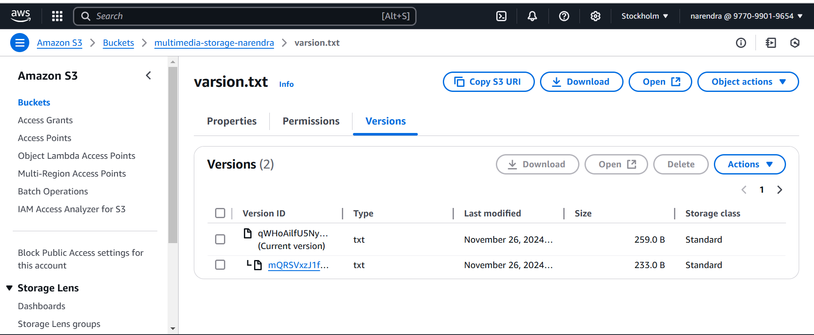
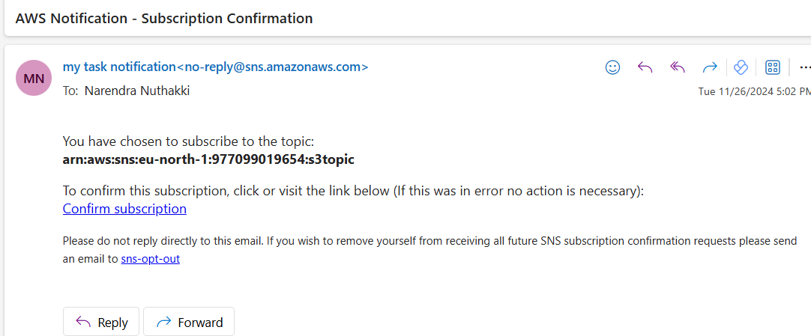

## Real-World Example

* Imagine a scenario where a media company needs to store high-resolution images and video content. The images/ folder is used for frequently accessed images, while videos/ are archived after a certain period. Content must be stored securely, with only authorized users able to access and manage files, while older files are automatically archived for cost efficiency.

## Task Overview
* Participants will create an S3-based solution to store, organize, manage, and archive multimedia content (e.g., images, videos, documents). They’ll learn to set up bucket configurations, use object versioning, implement lifecycle policies, and enforce security through bucket policies and access controls.

## Objectives
•	Gain practical experience with S3 bucket creation, object storage, versioning, and lifecycle policies.
•	Learn to secure data using bucket policies, encryption, and access control lists (ACLs).
•	Understand cost optimization through storage class transitions and lifecycle management.
•	Use S3 event notifications to simulate file management automation.

## Step-by-Step Task Instructions
*	Create an S3 Bucket with Appropriate Naming and Versioning
*	Create a new S3 bucket named multimedia-storage-[yourname]-bucket.
*	Enable bucket versioning to manage file versions and track changes over time.
*	Upload a few files with the same name multiple times to test versioning. Observe how S3 maintains versions of each object.

## Implement Lifecycle Policies for Cost Optimization
* Set up lifecycle policies for each folder to move objects to cost-effective storage classes over time:
* Move objects in the images/ folder to S3 Standard-IA (Infrequent Access) after 30 days.
* Move objects in the videos/ folder to S3 Glacier after 60 days and delete them after 180 days.
* Experiment with different configurations for archiving data based on folder and file type.
* Document each lifecycle policy created and explain why it’s optimized for cost and access patterns.

## Enable Server-Side Encryption
* Apply server-side encryption to the bucket to secure data at rest.
* Use S3 managed keys (SSE-S3) or AWS KMS keys (SSE-KMS).
* Document the steps taken to enable encryption and the differences between SSE-S3 and SSE-KMS.                        
                            
                            

                            
                                                                                                                                                                                                                                                                                    